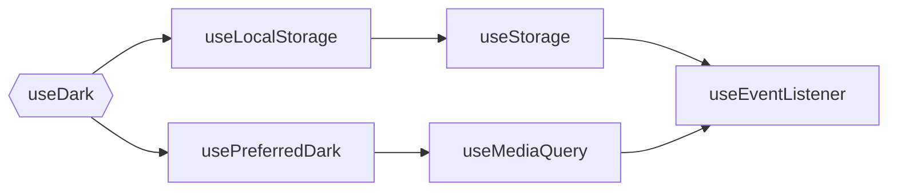

---
# try also 'default' to start simple
theme: seriph
# random image from a curated Unsplash collection by Anthony
# like them? see https://unsplash.com/collections/94734566/slidev
background: 	https://source.unsplash.com/collection/94734566/1920x1080
# apply any windi css classes to the current slide
class: 'text-center'
# https://sli.dev/custom/highlighters.html
highlighter: shiki
# show line numbers in code blocks
lineNumbers: false
# font family
fonts:
  # 用于代码块、内联代码等
  mono: 'DM mono'
  # 基础字体
  sans: 'Robot'
  # 与 windicss 的 `font-serif` css 类一同使用
  serif: 'Robot Slab'
hideInToc: true
---

# Vue3 Introduction <logos-vue />

同花顺 T2 职级课 -- Vue3 专题

<div class="abs-br mr-16 mb-25 text-left gap-2 text-light-900">
  <p class="leading-10">分享: 沈佳棋</p>
  <p class="leading-10">部门: B2C开发基础架构组</p>
</div>

<!-- <div class="pt-12">
  <span @click="$slidev.nav.next" class="px-2 py-1 rounded cursor-pointer" hover="bg-white bg-opacity-10">
    Press Space for next page <carbon:arrow-right class="inline"/>
  </span>
</div> -->

<div class="abs-br m-6 flex gap-2">
  <button @click="$slidev.nav.openInEditor()" title="Open in Editor" class="text-xl icon-btn opacity-50 !border-none !hover:text-white">
    <carbon:edit />
  </button>
  <a href="https://github.com/PaulChess/vue3-intro" target="_blank" alt="GitHub"
    class="text-xl icon-btn opacity-50 !border-none !hover:text-white">
    <carbon-logo-github />
  </a>
</div>

<!--
The last comment block of each slide will be treated as slide notes. It will be visible and editable in Presenter Mode along with the slide. [Read more in the docs](https://sli.dev/guide/syntax.html#notes)
-->

---
hideInToc: true
layout: center
---

<div grid="~ cols-2 gap-x-26">

<div class="flex justify-center items-center">

<logos-vue class="w-60 h-60" />

</div>

<div>

# 目录

<toc max-depth="1" mode="all" />

</div>

</div>

---
layout: center
---

# 重构后的 Vue3 带来了什么?

---

<div grid="~ cols-2 gap-x-4 gap-y-2">

### 新特性:
### 框架性能提升：

<div>

- 使用 proxy 代理，修复 Vue2 响应式弊端
- **Composition API**
- TypeScript 支持
- patchFag 静态标记
- 优化跨端问题
- 新组件 `Fragment`、`Teleport`、`Suspense`
- 新增 `v-memo` 缓存 html 模板
- 支持 TreeShaking
- 自定义渲染器
- 构建工具 Vite
- ...

</div>

<div>

- 资源大小减少 `41%`
- 初始渲染速度加快 `55%`
- 更新速度加快 `133%`
- 内存占用减少 `54%`

</div>

</div>

---
layout: center
---

# Vue3 核心知识点讲解

---
layout: center
---

### 新文档:

[https://staging-cn.vuejs.org/](https://staging-cn.vuejs.org/)

---
layout: center
---

<div grid="~ cols-2 gap-x-3">

<div>


</div>

<div>


</div>

</div>

---
layout: center
---

### Vue3 核心知识点:

<div class="mt-2">

- 内置新增组件 `Fragment`、`Teleport`、`Suspense`
- `watch` 与 `watchEffect` 的区别
- ` <script setup> ` 语法（3.2+）
- `css` 动态变量注入（3.2+）
- `Composition API`
- ...

</div>

[Try in playground](
https://sfc.vuejs.org/)

---
layout: center
---

# Composition API  <logos-vue />

---
clicks: 7
---

<div class="mb-2">

#### Compostion API 是 Vue3 中引入的编写组件的新方式

<div class="absolute right-15 top-10" v-show="$slidev.nav.clicks >= 7">
  <dark-toggle />
</div>

</div>

<div grid="~ cols-2 gap-x-3 gap-y-2">

###### Options API
###### Composition API

```js {all|all|2,10,14,18|2-9|10-13|14-17|18-20|all}
export default {
  data() {
    return {
      media: matchMedia(
        '(prefers-color-scheme: dark)'
      )
      dark: false,
    }
  },
  methods: {
    toggleDark() { this.dark = !this.dark },
    update() { this.dark = this.media.matches }
  },
  created() {
    this.media.addEventListener('change', this.update)
    this.update()
  },
  destroyed() {
    this.media.removeEventListener('change', this.update)
  }
}
```

<div v-show="$slidev.nav.clicks >= 1">

```js {*|*|3|4-7|9-10|12-13|14-16|all} {at:0}
import { ref, onUnmounted } from 'vue'
export default {
  setup() {
    const media = matchMedia(
      '(prefers-color-scheme: dark)'
    )
    const dark = ref(media.matches)

    const toggleDark = () => dark.value = !dark.value
    const update = () => dark.value = media.matches
    
    update()
    media.addEventListener('change', update)
    onUnmounted(() => {
      media.removeEventListener('change', update)
    })

    return { dark, toggleDark }
  }
}
```

</div>

</div>

<!--
有些人可能会有疑问了，从代码上看也没啥明显区别啊? 我们想想，Vue2 的复用单元是组件，是template, script, style 的组合，如果我们在跨项目或者跨团队复用的时候由于dom或者样式不同无法直接复用组件，仅仅需要这一段核心逻辑的时候该怎么办呢? 有些人可能会说，用 mixin啊，但是大家想想 mixin 有什么问题? 来源不清晰，上下文不清晰，比如一个页面里注册了多个 mixin 以后，我可以任意调用某个 mixin 中的 data 或者是 method, 到时候溯源的时候找都找不到，只能全局搜索。
所以我们来对比一下选项式API和组合式API
-->

---
clicks: 6
---

#### `Options API` VS `Composition API`

<div class="grid grid-cols-2 gap-x-4 gap-y-4 mt-2">

###### 对象式 API 存在的问题

###### 组合式 API 提供的能力

<v-clicks at="1">

- 不利于复用
- 潜在命名冲突（mixin）
- 上下文丢失
- 有限的类型支持
- 按 API 类型组织

</v-clicks>

<v-clicks at="1">

- 极易复用 (原生 JS 函数)
- 可灵活组合 (生命周期钩子可多次使用)
- 提供更好的上下文支持
- 更好的 TypeScript 类型支持
- 按功能/逻辑组织（思维方式变更）
- 可独立于 Vue 组件使用（`@vue/reactivity`）

</v-clicks>

</div>

<!--
所以，Composition API 可以帮助我们抽取最核心、最本质的功能，脱离掉视图层的约束，达到最高程度的封装复用，从而带来更高的扩展性。
-->

---

## But...

<div>

<div v-click class="mt-4">

#### 使用 Compsition API 的 **思想误区**:

</div>

<div v-click>

没有了这些 Option 的限制，`data`、`computed`、`method` 我可以随便写在函数的某个位置了 ❌

</div>

<div v-click>

解释: Composition API 最重要的目的是帮助我们做功能拆分 && 功能组合，而不是说一个组件 setup 函数里面密密麻麻写了 2000 行代码

</div>

</div>

<div>

<div v-click class="mt-10">

#### Compostion API 的 **"缺点"**:  

</div>

<div v-click class="leading-8 mt-2">
非常考验开发对功能的抽象能力，抽离方式不当的话反而会适得其反，降低代码的可维护性。   
  
所以 Vue3 一方面给前端开发带来了更高的灵活性，也对开发人员在代码设计层面提出了更高的要求。
</div>

<div v-click class="mt-8">

#### Note: 新技术出来的时候也不要一味拉踩老技术，Option API 与 Composition API 体现的仅仅是编程抽象思想上的不同，因此 Vue3 也兼容了 Option API 的写法。

</div>

</div>

---
layout: center
---

### Composition API 示例:

<div class="mt-2">

- <span class="text-gray-400">useDark</span>
- **useStorage**
- **useEventListener**
- **useFetch**

</div>

---
hideInToc: true
---

# useStorage <github-logo url="https://github.com/vueuse/vueuse/blob/main/packages/core/useStorage/index.ts" />

<use-storage-demo />

<div class="mt-4" v-click>

```javascript
import { useStorage } from '@vueuse/core'
import { stringify } from '@vueuse/docs-utils'

const state = useStorage('vue-use-local-storage', {
  name: 'Banana',
  color: 'Yellow',
  size: 'Medium',
  count: 0,
})

const text = stringify(state.value)
```

上面代码中的 `state` 和 `text` 均为响应式数据，仅需如上注册一次，我们就无须再考虑监听数据变化再进行 storage 存取操作的事情。

</div>

---

### 逻辑组合

<div class="mt-6">



</div>

<div v-click class="mt-6">

- 其中每一个函数都可以独立使用
- 专注点分离
- 建立 输入 → 输出 的连结
- 输出会自动根据输入的改变而改变

</div>

---
hideInToc: true
---

# useEventListener <github-logo url=“https://github.com/vueuse/vueuse/blob/main/packages/core/useEventListener/index.ts” />

<div v-click>

```javascript
import { useEventListener } from '@vueuse/core'

const element = ref<HTMLDivElement>()
useEventListener(element, 'keydown', (e) => { console.log(e.key) })
```

</div>

<div v-click class="mt-6">

```ts
import { onUnmounted } from 'vue'

export function useEventListener(target: EventTarget, name: string, fn: any) {
  target.addEventListener(name, fn)

  onUnmounted(() => {
    target.removeEventListener(name, fn) // <--
  })
}
```

自动清除副作用，仅需封装一次，使用时无须考虑事件导致的内存泄露问题

</div>

---
hideInToc: true
---

# useFetch <github-logo url=“https://github.com/vueuse/vueuse/blob/main/packages/core/useFetch/index.ts” />

<div>

使用 `useFetch`，我们甚至可以将异步请求转换为 "同步"

</div>

<div v-click>

###### 正常的异步请求

```ts
const data = await fetch('https://api.github.com/').then(r => r.json())

// use data
```

</div>
<div v-click>

###### 使用 ` useFetch `

```ts
const { data } = useFetch('https://api.github.com/').json()

const user_url = computed(() => data.value?.user_url)
```

</div>
<div v-click> 

先建立数据间的“连结”，然后再等待异步请求返回将数据填充。概念和 React 中的 SWR (stale-while-revalidate) 类似。

</div>

---
layout: center
---

<div class="text-center">

### Any More?

</div>

<vue-use v-click />

---
layout: center
---

# 调试：Vue DevTools

---

### 调试组件


---

### 调试路由


---

### 调试 Vuex


---
layout: center
---

# Vue3 生态下，我们能做些什么?

---

##### 赋能业务开发的工具：

<div class="mt-3">

- UI 组件库: PC、移动端（将公司内现有的 Vue2 组件库进行升级）
- 高可复用的 Composition API 库（基于 VueUse）
- 业务型脚手架（在现有开源脚手架的基础上封装业务常用功能，npm 包、vscode 插件均可，  
内置功能尽可能做到可插拔）
- 业务型物料组件

<div class="mt-8" v-motion :initial="{ x: -200 }" :enter="{ x: 0 }" v-click>

### **核心原则: 为业务开发提效但不要重复造轮子 !!!**

</div>

<div class="mt-4" v-click>

1. 基于开源工具实现业务属性扩展
2. 不同部门的物料、工具要能共享

</div>

</div>

---

##### 关于兼容性


<div class="mt-4">

- IOS >= 10
- Android >= 5
- IE 不支持

</div>

<div class="mt-4" v-click>

###### Coming Soon... 提前学习，提前踩坑，提前布局

###### 种一棵树最好的时机是十年前，其次是现在。

</div>

---
layout: center
---

# Vue3 学习资料推荐

---

### Vue3 learning resource recommend

<div class="mt-4 gap-12" grid="~ cols-2">

<div class="mt-2">

- 书籍:《Vue.js 设计与实现》
- 在线课程: 《极客时间-玩转 Vue3 全家桶》
- 新文档: https://staging-cn.vuejs.org/
- Awesome Vue: https://github.com/vuejs/awesome-vue
- Vue3 源码: https://github.com/vuejs/core
- 优质博客: https://antfu.me/posts
- 优质 Vue3 组件库: [移动端 Vant](https://github.com/youzan/vant)、[PC端 NaiveUI](https://github.com/TuSimple/naive-ui)
- 优质起手模板: https://github.com/antfu/vitesse
- Vue3 生态链: Pinia、Vitest、VueRouter4...
</div>


</div>

---
layout: center
---

# 作业

---
layout: center
---

### HomeWork

[Hxmui-Vue3](https://624048969bfc270009faf07f--dynamic-moxie-790dbc.netlify.app/#/zh-CN/home)

挑选下列 `5` 个组件之一，根据交互需求描述及UI稿使用 Vue3 进行开发

- Loading 加载
- Toast 轻提示
- Dialog 对话框
- Cell 单元格
- Layout 布局

<div class="mt-6">

**作业提交形式**：在仓库的主分支中拉取代码，以 `feat-姓名` 的形式创建分支，组件开发完成后提交 pull request 到主分支上。

</div>

<div class="mt-6">

**作业提交时间**：xx 月 xx 日前

</div>